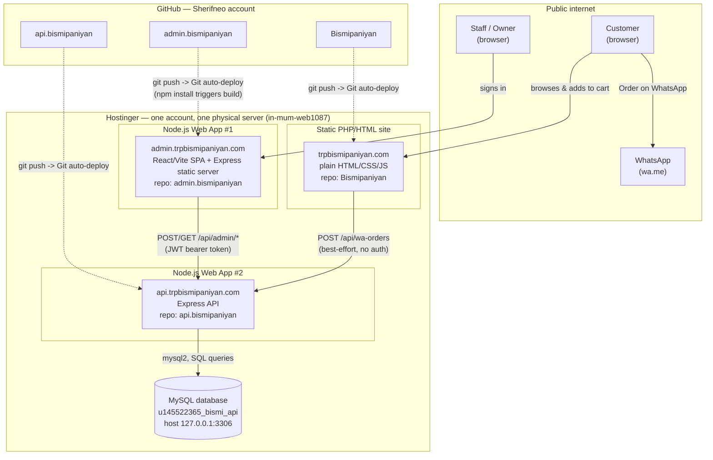

# Bismi Bakery — Technical Structure

One-page reference for the entire system: what exists, how the pieces connect, and every real infrastructure detail (domains, repos, databases, IPs, hosting type). Read this first if you're picking this project up cold.

## The three pieces, in one sentence each

1. **Website** (`trpbismipaniyan.com`) — public marketing site with a product catalog and a WhatsApp-based cart/ordering flow. Plain HTML/CSS/JS, no build step.
2. **Admin Portal** (`admin.trpbismipaniyan.com`) — internal staff tool for back-office operations (Cash Book, Inventory, Partners/Settlements, WhatsApp Orders worklist). React/Vite SPA.
3. **Backend API** (`api.trpbismipaniyan.com`) — the one piece with a database. Node.js/Express, serves both the admin portal and the website's WhatsApp-order-recording call.

None of these three share a codebase or a repo. They are three independent Git repositories, each with its own Hostinger deploy target, connected only over HTTPS at runtime (the website and admin portal both call the backend's API; nothing calls the other way).

## Flow chart

## Repos and where they deploy

| Piece | GitHub repo | Hostinger target | Public URL |
|---|---|---|---|
| Website | `github.com/Sherifneo/Bismipaniyan` | Static PHP/HTML site | `trpbismipaniyan.com` |
| Admin Portal | `github.com/Sherifneo/admin.bismipaniyan` | Node.js Web App | `admin.trpbismipaniyan.com` |
| Backend API | `github.com/Sherifneo/api.bismipaniyan` | Node.js Web App | `api.trpbismipaniyan.com` |

All three deploy via Hostinger's **Git auto-deploy** — push to `main`, Hostinger pulls and redeploys automatically. No manual FTP/upload, no staging/UAT environment for any of the three.

## Why 2 Web Apps and not 1

The Admin Portal (a static React build) and the Backend (a live, always-running Express+MySQL server) are fundamentally different kinds of deployment even though both run on "Node.js App" hosting — the Admin Portal only needs Node to *build* itself once, then it's static files; the Backend needs Node running continuously to answer API requests. They were kept as two separate apps rather than combined into one, deliberately, so that:
- The Admin Portal can be redeployed/restarted without ever touching the live API.
- Each module (Cash Book, Inventory, Partners, and future ones) stays loosely coupled, which matters because the plan is to eventually sell individual modules to other customers, not just the whole system as one bundle.

See `backend/DEPLOYMENT.md` and `admin-portal/DEPLOYMENT.md` for the full reasoning and setup steps for each.

## Server & database detail

All three pieces live under **one Hostinger hosting account**, on **one physical server**:

- **Server**: `in-mum-web1087` (Hostinger's internal server name, Mumbai)
- **SSH access**: `ssh -p 65002 u145522365@82.112.225.66` — same login gets you onto the server for any of the account's sites, not scoped to one app
- **Node runtime path** (SSH shell has no `node` on `$PATH` by default): `/opt/alt/alt-nodejs22/root/usr/bin/node` (also `18`/`20`/`24` available under `/opt/alt/`)

**Database** — one MySQL database, used only by the Backend API:

| Field | Value |
|---|---|
| Database name | `u145522365_bismi_api` |
| Username | `u145522365_bismi_apiuser` |
| Host (from the app's point of view) | `127.0.0.1:3306` (same physical server as the backend — not a separate remote DB server) |
| Engine | MySQL (not PostgreSQL — see below) |
| Created under | must be created/managed while viewing `api.trpbismipaniyan.com`'s hPanel context specifically — see "Gotcha" below |

There is **no separate database for the Admin Portal** — it has zero database code and talks to the Backend over HTTPS for everything. There is **no database for the Website** either — it's fully static, and its one dynamic behavior (recording a WhatsApp order attempt) is a fire-and-forget call to the Backend's public endpoint.

### Why MySQL, not PostgreSQL

The backend was originally built against PostgreSQL by default, without first checking what Hostinger's plan actually supports. Corrected mid-build: Hostinger's shared hosting only offers MySQL (confirmed in hPanel's Databases section — no Postgres option exists), and the explicit goal is everything on Hostinger with no outside database provider. The entire schema and query layer were rewritten for MySQL. Lesson recorded in memory for future client projects: check the actual hosting's supported database engine *before* writing backend code.

### Gotcha: database scoping in hPanel

Hostinger's Databases screen is scoped per-site in the panel UI, even though the underlying MySQL server is shared across the whole account. A database created while viewing `admin.trpbismipaniyan.com`'s dashboard was not usable by the app deployed under `api.trpbismipaniyan.com` — same account, same physical MySQL server, but the credentials didn't work until the database was recreated while viewing the correct site's context. Always create a database while viewing the same site/app that will actually use it. Full debugging story in `backend/DEPLOYMENT.md`.

## Environment variables (by app)

**Admin Portal** (`admin.bismipaniyan` Web App):
- `VITE_API_BASE` = `https://api.trpbismipaniyan.com` (optional — falls back to hostname detection if unset)

**Backend** (`api.bismipaniyan` Web App):
- `DATABASE_URL` = `mysql://u145522365_bismi_apiuser:<password>@127.0.0.1:3306/u145522365_bismi_api`
- `JWT_SECRET` = a long random string (used to sign admin session tokens)

**Website**: none — it's fully static, `config.js` detects environment purely by `location.hostname`.

## What talks to what, and how

- **Website → Backend**: one call, `POST /api/wa-orders`, no authentication, CORS wide open (public marketing site). Fire-and-forget — the website still opens WhatsApp even if this call fails.
- **Admin Portal → Backend**: every data operation, `/api/admin/*`, authenticated with a JWT bearer token (`Authorization: Bearer <token>`) obtained from `/api/admin/auth/login`. Token stored in the browser's `localStorage` under `bp_admin_token`.
- **Backend → MySQL**: the only database connection in the whole system. Every write from the Admin Portal or the Website ultimately lands here.
- **Nothing talks directly between Website and Admin Portal.** They're only connected through the Backend.

## First login (seeded, rotate this)

- Email: `faizal24ind@gmail.com`
- Password: `ChangeMe123!`
- Seeded via `backend/src/db/seed.js`, run once over SSH after the first migration. No change-password screen exists yet — see `backend/CLAUDE.md`'s "What's built vs. not."

## Where to go next

- `backend/DEPLOYMENT.md` — full backend deploy steps + every gotcha hit doing this the first time
- `admin-portal/DEPLOYMENT.md` — admin portal deploy steps
- `website/DEPLOYMENT.md` — website deploy steps
- `backend/BUSINESS-MODEL-FEATURES.md` — the actual business (3-way commission model, per-location inventory, etc.) that drives every design decision in this system
- `admin-portal/ADMIN-PORTAL-PLAN.md` — the full module build order, what's built vs. not
